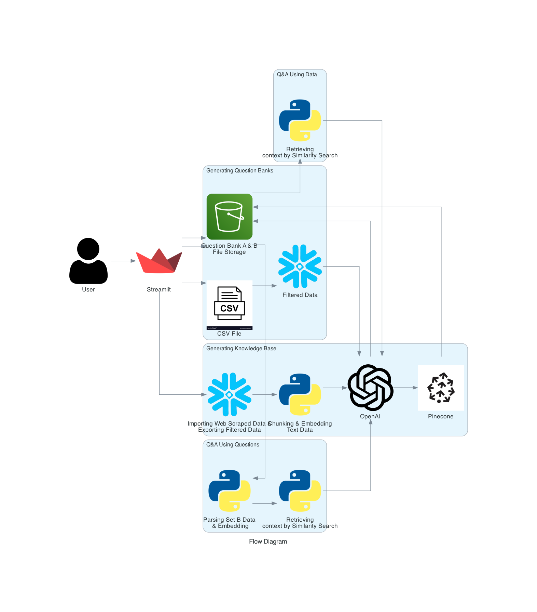

# Assignment5

[](https://codelabs-preview.appspot.com/?file_id=16RIkuYAn1gVqzdY9vEQm-D05KU_TJGxsX5F_moBojMI#0)

[](https://drive.google.com/file/d/1XGsVICAoXeOR9Hc9VX-W9RL_PZo417ND/view?usp=sharing)

## Technologies Used

[](https://streamlit.io/)
[](https://github.com/)
[](https://fastapi.tiangolo.com/)
[](https://aws.amazon.com/)
[](https://www.python.org/)
[](https://pandas.pydata.org/)
[](https://www.docker.com)
[](https://cloud.google.com)
[
](https://www.snowflake.com/en/?_ga=2.41504805.669293969.1706151075-1146686108.1701841103&_gac=1.160808527.1706151104.Cj0KCQiAh8OtBhCQARIsAIkWb68j5NxT6lqmHVbaGdzQYNSz7U0cfRCs-STjxZtgPcZEV-2Vs2-j8HMaAqPsEALw_wcB)
[](https://www.pinecone.io/)
[](https://openai.com/)

## Problem Statement

This project aims to develop a structured database and text extraction system for finance professional development resources. By leveraging Models as a Service (MaaS) APIs such as Pinecone and OpenAI, the goal is to create knowledge summaries, generate question-answer sets, and implement a vector database query system. The objective is to enhance knowledge retrieval and question-answering capabilities for financial analysts, ultimately improving learning outcomes and efficiency in professional development.

## Project Goals

The objective of this project is to develop a comprehensive web application aimed at enhancing the learning and testing capabilities of financial analysts using content from the CFA Institute. Below is a breakdown of the tasks implemented in the flow to achieve our project goals:

### 1. Knowledge Base Creation
- Generate detailed technical notes for each Learning Outcome Statement (LOS) using the introduction, summary, and LOS content as context.
- Consolidate all notes into a single markdown document for streamlined access and reference.
Segment and store each LOS and its corresponding notes in Pinecone for efficient retrieval.
### 2. Question Bank Development
- Analyze and mimic the format and complexity of CFA sample questions to construct two distinct sets of 50 questions each, designed to test understanding of the summarized topics.
- Utilize the summaries as a source to ensure the questions are deeply rooted in the actual content.
- Store the first set of questions (Set A) in Pinecone under distinct namespaces for questions and answers, and keep the second set (Set B) separate for later analysis.
### 3. Retrieval-Augmented Testing
- Implement a Retrieval-Augmented Generation (RAG) model to match questions from Set B with similar questions from Set A stored in Pinecone.
- Use GPT-4 to generate answers for Set B questions based on the responses retrieved for Set A, providing justifications for each answer.
- Evaluate the accuracy of the answers to gauge the effectiveness of this retrieval-based approach.
### 4. Direct Knowledge Retrieval Comparison
- Leverage the detailed knowledge base created in Task 1 to directly answer questions from both Set A and Set B.
- Employ RAG to search for relevant LOS and their summaries that might contain the answers.
- Compare the performance of direct knowledge retrieval against the retrieval-augmented approach from Task 3 in answering the combined 100 questions.

The successful execution of these tasks will culminate in a robust training and assessment tool that supports financial analysts in mastering CFA content through interactive testing and detailed explanations. This workflow is designed to be adaptive, scalable, and efficient, utilizing advanced AI techniques and vector database technology for enhanced learning outcomes.

# Architecture:



# Codelab

link: https://codelabs-preview.appspot.com/file_id=16RIkuYAn1gVqzdY9vEQm-D05KU_TJGxsX5F_moBojMI#0

## Pre-requisites

Before running this project, ensure you have the following prerequisites set up:

- **Python**: Ensure Python is installed on your system.
- **Docker**: Ensure Docker-desktop is installed on your system.
- **Virtual Environment**: Set up a virtual environment to manage dependencies and isolate your project's environment from other Python projects. You can create a virtual environment using `virtualenv` or `venv`.
- **requirements.txt**: Install the required Python dependencies by running the command:
  ```
  pip install -r requirements.txt
  ```
- **Config File**: Set up the `configurations.properties` file with the necessary credentials and configurations.

- **Snowflake**: ensure you have the necessary credentials and configurations set up in the `configurations.properties` file for connecting to Snowflake.
- **Google Cloud Platform**: Create a Google Cloud Engine. Ensure you have the necessary credentials and configurations set up in the `configurations.properties` file.

## Program Structure

```
📦
├─ .gitignore
├─ README.md
├─ __init__.py
├─ architecture-diagram
│  ├─ diagram.ipynb
│  ├─ flow_diagram.png
│  ├─ input_icons
│  │  ├─ csv-file.jpg
│  │  ├─ openai.png
│  │  ├─ pinecone.png
│  │  ├─ streamlit.png
│  │  └─ user.png
│  └─ requirements.txt
├─ backend
│  ├─ Dockerfile
│  ├─ __init__.py
│  ├─ compare_questions.py
│  ├─ generate_knowledge_base.py
│  ├─ generate_ques_bank
│  │  ├─ create_question_banks.py
│  │  ├─ qa_df_set_a_qa.csv
│  │  ├─ qa_df_set_b_qa.csv
│  │  ├─ requirements.txt
│  │  ├─ sample_pdf_text_extraction.py
│  │  └─ storing_in_pinecone.py
│  ├─ output
│  │  ├─ qa_df_set_a_b_qa.csv
│  │  ├─ qa_df_set_a_b_qa_with_openai_response.csv
│  │  ├─ snowfkake_data.csv
│  │  ├─ technical_documents.csv
│  │  └─ technical_documents_markdown.md
│  ├─ q&a_using_question_bank.py
│  ├─ storing_knowledge_summaries
│  │  ├─ __init__.py
│  │  └─ storing_knowledge_embeddings_using_pinecone.py
│  └─ utils
│     ├─ generate_knowledge_base.ipynb
│     └─ storing_knowledge_embeddings_using_pinecone.ipynb
├─ docker-compose.yaml
├─ frontend
│  ├─ Dockerfile
│  ├─ __init__.py
│  ├─ app.py
│  ├─ generate_kb.py
│  ├─ generate_qb.py
│  ├─ query_data_comparison.py
│  └─ query_similar_questions.py
├─ requirements.txt
└─ setup
   ├─ requirements.txt
   ├─ scraped_data.csv
   └─ webscrape_data_to_snowflake.py
```

©generated by [Project Tree Generator](https://woochanleee.github.io/project-tree-generator)

## How to Run the Application Locally

To run the application locally, follow these steps:

1. Clone the repository to get all the source code on your machine.

2. Use `source/venv/bin/activate` to activate the environment.

3. Create a .env file in the root directory with the following variables:

```
[AWS]
access_key =
secret_key =
region_name =
bucket =
pdf_level_1 =
pdf_level_2 =
pdf_level_3 =
pdf_files_folder_name =
analysis_folder_name =
question_folder_name =
txt_file_folder_name =
part3_filename =
part3_folder =

[SNOWFLAKE]
user =
password =
account =
warehouse =
database =
schema =
role =
cfa_table_name =

[OPENAI]
api_key =

[PINECONE]
pinecone_api_key =
index =
```

4. Once you have set up your environment variables, Use `docker-compose up - build` to run the application

5. Access the Streamlit UI by navigating to http://localhost:8501/ in your web browser.

## Learning Outcomes

By completing this project, you will:

### 1. Knowledge Base Development:
   - Construct a comprehensive knowledge base using Learning Outcome Statements (LOS) from the CFA Institute documents.
   - Develop skills in organizing and summarizing complex financial content for educational purposes.

### 2. Question Bank Formulation:
   - Design a question bank that mimics the format and complexity of CFA examination questions using AI-generated content.
   - Gain experience in crafting multiple-choice questions that effectively test the understanding of financial concepts.

### 3. Vector Database Utilization:
   - Implement and manage a vector database using Pinecone to store and retrieve question sets and learning summaries.
   - Understand the importance and application of vector databases in managing and retrieving semantically similar queries.

### 4. Retrieval-Augmented Generation (RAG) Deployment:
   - Utilize Retrieval-Augmented Generation techniques to enhance question answering capabilities using AI models like GPT-4.
   - Develop proficiency in integrating AI models with databases to fetch relevant content that aids in generating accurate answers.

### 5. Comparative Analysis of Knowledge Retrieval Methods:
   - Compare and evaluate the effectiveness of direct knowledge retrieval versus retrieval-augmented methods in answering financial questions.
   - Learn to analyze the performance of different AI-driven retrieval methods to determine the best approach for specific use cases.

### 6. Web Application Development for Educational Tools:
   - Create a multipage Streamlit application that serves as an educational tool for financial analysts.
   - Develop an understanding of how to build interactive and user-friendly educational web applications.

These outcomes will provide learners with advanced skills in creating and managing educational content and tools, specifically in the financial sector, leveraging the latest technologies in AI and vector databases. This project will also enhance understanding of AI applications in education and test preparation.

## Team Information and Contribution

| Name                      | Contribution % |
| ------------------------- | -------------- |
| Muskan Deepak Raisinghani | 33.3%          |
| Rachana Keshav            | 33.3%          |
| Ritesh Choudhary          | 33.3%          |
