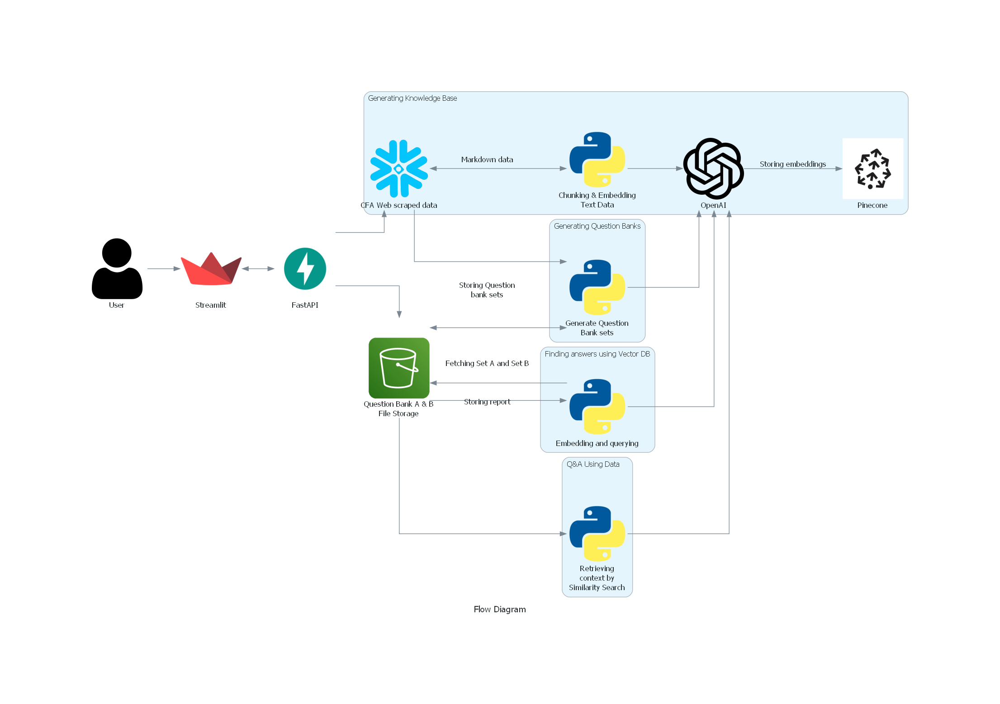

# Assignment5

[](https://codelabs-preview.appspot.com/?file_id=16RIkuYAn1gVqzdY9vEQm-D05KU_TJGxsX5F_moBojMI#0)

[](https://drive.google.com/file/d/1XGsVICAoXeOR9Hc9VX-W9RL_PZo417ND/view?usp=sharing)

## Problem Statement

Many data-driven projects involve extracting data from various sources, such as CSV and XML files, and transforming it for analysis or storage. However, ensuring the quality and integrity of this data throughout the process can be challenging. Till now, we have made the ELT pipelines for extraction, schema validations and transformations. Now, the goal is to automate the entire process using AirFlow and develop API's with a user interface to give the end user the power to implement it all using single-click operations.

## Project Goals

The aim of this project is to develop a robust web application workflow for processing and extracting data from PDF files. Below is a breakdown of the tasks implemented in the flow to achieve our project objectives:

### 1. User Interface

- Implement a user-friendly interface to handle PDF uploads and user queries.

### 2. Application Hosting and Containerization

- Deploy Google Cloud Engines to host the web application, allowing for scalable processing power.
- Utilize Docker to containerize the application, ensuring consistent environments and easy deployment across instances.

### 3. Automation and Processing Pipeline

- Integrate Streamlit to create an interactive web interface for users to upload PDF files directly into the system.
- Utilize FastAPI to build efficient and performant RESTful APIs for handling user queries and automating interactions with the processing pipeline.

### 4. Workflow Execution and Data Management

- Implement an automated pipeline, triggered by Airflow, to manage tasks from PDF upload on S3 to deployment on GCP.
- Store PDF files securely and manage them effectively using S3.

### 5. Data Extraction and Validation

- Run snowflake_objects.sql file to create objects into snowflake required for the application.
- Automate the extraction of data from PDF files using Python scripts.
- Validate extracted data with Pydantic to ensure integrity and structure before further processing.

### 6. Data Loading and Storage

- Load the validated data into Snowflake, a cloud data warehouse, for persistent storage, analysis, and reporting.
- Ensure that both PDF content and metadata are handled correctly during the loading process.

The successful implementation of these tasks will result in a streamlined process for PDF data management, from the point of user interaction to data storage and analysis. Our workflow is designed to be resilient, scalable, and maintainable, with clear separation of concerns and ease of monitoring.

---

## Technologies Used

[](https://streamlit.io/)
[](https://github.com/)
[](https://fastapi.tiangolo.com/)
[](https://aws.amazon.com/)
[](https://www.python.org/)
[](https://pandas.pydata.org/)
[](https://airflow.apache.org/)
[](https://www.docker.com)
[](https://cloud.google.com)
[](https://www.postgresql.org)
[
](https://www.snowflake.com/en/?_ga=2.41504805.669293969.1706151075-1146686108.1701841103&_gac=1.160808527.1706151104.Cj0KCQiAh8OtBhCQARIsAIkWb68j5NxT6lqmHVbaGdzQYNSz7U0cfRCs-STjxZtgPcZEV-2Vs2-j8HMaAqPsEALw_wcB)

# Architecture:



# Codelab

link: https://codelabs-preview.appspot.com/?file_id=1pxHAQOrGnbCH2bQbzj-NBEtagLDbVzRR-P9cAtZ_J40#2

## Pre-requisites

Before running this project, ensure you have the following prerequisites set up:

- **Python**: Ensure Python is installed on your system.
- **Docker**: Ensure Docker-desktop is installed on your system.
- **Virtual Environment**: Set up a virtual environment to manage dependencies and isolate your project's environment from other Python projects. You can create a virtual environment using `virtualenv` or `venv`.
- **requirements.txt**: Install the required Python dependencies by running the command:
  ```
  pip install -r requirements.txt
  ```
- **Config File**: Set up the `configurations.properties` file with the necessary credentials and configurations.

- **Snowflake**: Use `airflow/dags/load/snowflake_objects.sql` to define the queries on snowflake. Also, ensure you have the necessary credentials and configurations set up in the `configurations.properties` file for connecting to Snowflake.
- **Google Cloud Platform**: Create a Google Cloud Engine. Ensure you have the necessary credentials and configurations set up in the `configurations.properties` file.

## Program Structure

```
📦
├─ .gitignore
├─ README.md
├─ __init__.py
├─ architecture-diagram
│  ├─ diagram.ipynb
│  ├─ flow_diagram.png
│  ├─ input_icons
│  │  ├─ csv-file.jpg
│  │  ├─ openai.png
│  │  ├─ pinecone.png
│  │  ├─ streamlit.png
│  │  └─ user.png
│  └─ requirements.txt
├─ backend
│  ├─ Dockerfile
│  ├─ __init__.py
│  ├─ compare_questions.py
│  ├─ generate_knowledge_base.py
│  ├─ generate_ques_bank
│  │  ├─ create_question_banks.py
│  │  ├─ qa_df_set_a_qa.csv
│  │  ├─ qa_df_set_b_qa.csv
│  │  ├─ requirements.txt
│  │  ├─ sample_pdf_text_extraction.py
│  │  └─ storing_in_pinecone.py
│  ├─ output
│  │  ├─ qa_df_set_a_b_qa.csv
│  │  ├─ qa_df_set_a_b_qa_with_openai_response.csv
│  │  ├─ snowfkake_data.csv
│  │  ├─ technical_documents.csv
│  │  └─ technical_documents_markdown.md
│  ├─ q&a_using_question_bank.py
│  ├─ storing_knowledge_summaries
│  │  ├─ __init__.py
│  │  └─ storing_knowledge_embeddings_using_pinecone.py
│  └─ utils
│     ├─ generate_knowledge_base.ipynb
│     └─ storing_knowledge_embeddings_using_pinecone.ipynb
├─ docker-compose.yaml
├─ frontend
│  ├─ Dockerfile
│  ├─ __init__.py
│  ├─ app.py
│  ├─ generate_kb.py
│  ├─ generate_qb.py
│  ├─ query_data_comparison.py
│  └─ query_similar_questions.py
├─ requirements.txt
└─ setup
   ├─ requirements.txt
   ├─ scraped_data.csv
   └─ webscrape_data_to_snowflake.py
```

©generated by [Project Tree Generator](https://woochanleee.github.io/project-tree-generator)

## How to Run the Application Locally

To run the application locally, follow these steps:

1. Clone the repository to get all the source code on your machine.

2. Use `source/venv/bin/activate` to activate the environment.

3. Create a .env file in the root directory with the following variables:

```
[AWS]
access_key =
secret_key =
region_name =
bucket =
pdf_level_1 =
pdf_level_2 =
pdf_level_3 =
pdf_files_folder_name =
analysis_folder_name =
question_folder_name =
txt_file_folder_name =
part3_filename =
part3_folder =

[SNOWFLAKE]
user =
password =
account =
warehouse =
database =
schema =
role =
cfa_table_name =

[OPENAI]
api_key =

[PINECONE]
pinecone_api_key =
index =
```

4. Once you have set up your environment variables, Use `docker-compose up - build` to run the application

5. Access the Airflow UI by navigating to http://localhost:8080/ in your web browser.

6. Once the DAGs have run successfully, view the Streamlit application

7. Access the Streamlit UI by navigating to http://localhost:8501/ in your web browser.

8. Enter username and password if you've already logged in. Otherwise you can register yourself and then run the application.

## Learning Outcomes

By completing this assignment, you will:

1. **Cloud Services Deployment:**

   - Deploy and manage applications on GCP Engines.
   - Understand the benefits of using cloud services for scalability and reliability.

2. **Containerization with Docker:**

   - Create, manage, and deploy Docker containers to encapsulate application environments.
   - Utilize Docker for ensuring consistent deployments and isolating dependencies.

3. **Interactive Web Interface Creation:**

   - Design and implement interactive web interfaces using frameworks like Streamlit.
   - Handle file uploads and user input in a web application context.

4. **API Development:**

   - Build RESTful APIs with FastAPI to handle web requests and automate backend processes.
   - Integrate API endpoints with the user interface and processing pipeline.

5. **Automated Workflow Management:**

   - Use Apache Airflow to automate and manage the workflow pipeline.
   - Understand how to trigger and schedule tasks based on events or conditions.

6. **Data Extraction Techniques:**

   - Develop scripts to extract data from PDF documents.
   - Automate the process of extracting structured data from various document formats.

7. **Data Warehousing and ETL Processes:**

   - Load and transform data into a data warehouse like Snowflake.
   - Appreciate the role of ETL (Extract, Transform, Load) processes in data analytics.

8. **Data Security and Storage:**
   - Manage secure storage of files using appropriate file storage solutions.
   - Understand the considerations for data security in cloud-based storage.

These outcomes will equip learners with the skills and knowledge necessary to architect and implement scalable and efficient data processing systems in a cloud environment, with a focus on containerized applications and automated workflows.

## Team Information and Contribution

| Name                      | Contribution % |
| ------------------------- | -------------- |
| Muskan Deepak Raisinghani | 33.3%          |
| Rachana Keshav            | 33.3%          |
| Ritesh Choudhary          | 33.3%          |
